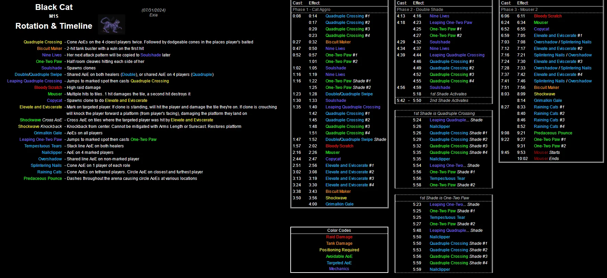

# Black Cat

- [Timeline and In Depth Mechanics Overview](indepth)
- [Index of Possible Strats](strats)

<details><summary><font size="4" color="LightBlue">Video Guides</font></summary>
  ### Hope
  
  ### Joonbob
  
  ### Hector
  
  ### MTQ
  
</details>
<details markdown=block>
  <summary>Markers</summary>
  ```json
  {"Name":"M1S","MapID":986,
  "A":{"X":100.0,"Y":0.0,"Z":90.0,"ID":0,"Active":true},
  "B":{"X":110.0,"Y":0.0,"Z":100.0,"ID":1,"Active":true},
  "C":{"X":100.0,"Y":0.0,"Z":110.0,"ID":2,"Active":true},
  "D":{"X":90.0,"Y":0.0,"Z":100.0,"ID":3,"Active":true},
  "One":{"X":110.0,"Y":0.0,"Z":95.0,"ID":4,"Active":true},
  "Two":{"X":110.0,"Y":0.0,"Z":105.0,"ID":5,"Active":true},
  "Three":{"X":90.0,"Y":0.0,"Z":105.0,"ID":6,"Active":true},
  "Four":{"X":90.0,"Y":0.0,"Z":95.0,"ID":7,"Active":true}}
  ```
</details>
[](https://photos.google.com/share/AF1QipM2gXlQlIJCfOnz3A7OuKOZJLfffEU_HqqzYlaryhexkDmNDuweRe_O0QoTYJt4nw/photo/AF1QipOCNMx50KXrNop6lgVEqNL0JK8Vc5pnHTawoxfu?key=NGl3VktZSm5HVkt3dEJsT2dyV0tNcVJTcWxvdkNB)
