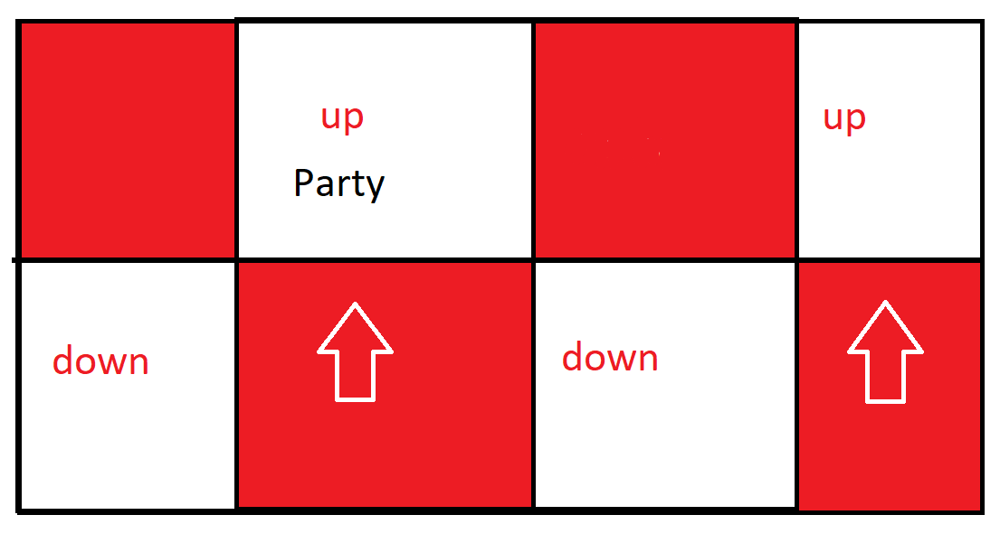

## Key
<dl>
  <dt>H</dt>
  <dd>featured in the Hector Lectures guide</dd>
  <dt>J</dt>
  <dd>featured in the Joonbob guide</dd>
  <dt>NASE</dt>
  <dd>featured in the NASE master pastebin</dd>
</dl>

# Quadruple Crossing

Clock Baits&nbsp;H

  This strat has everyone bait their cleaves on their clock spot, only moving in and out for the baits themselves, and dodging the non-baited aoes as they go off. DPS baiting first leaves the pair stacks on intercards, and the light party stacks on NW/SE. Support baiting first leaves partners on cardinals, and light parties on E/W

Same Baits(Intercards)&nbsp;NASE&nbsp;J

  This strat has both sets of baited aoes on the intercardinals, dps first, then supports taking their place after. stand on cardinals to dodge both sets of non-baited aoes. This will leave the pair stacks on cardinals, and the light party stacks on E/W

Same Baits(Cardinals)

  This strat has both sets of baited aoes on the cardinals, supports first, then dps taking their place after. stand on intercards to dodge both sets of non-baited aoes. This will leave the pair stacks on intercards, and the light party stacks on NW/SE

# Mouser

Standard(Same Tile)&nbsp;H&nbsp;NASE&nbsp;J

  Ranged position themselves on the outer 2 tiles and melee on the inner 2, and you can stay on your assigned non-cracked tile(still dodge the line aoes coming from other targeted players). if its a knockback, you can get knocked diagonally from one corner of your tile to the other. This is technically optional but you will be generally expected to be doing it.

Party Never Move

  Party positions on one of the 2 non-cracked tile in the center. Slams go out to the other side of the boss, and knockbacks get knocked from the other side onto the same row as the party. Can optionally have the knockback in the center get knocked diagonally from across the boss for true 0 party movement
  

# Nailchipper

True North&nbsp;H&nbsp;NASE&nbsp;J

  Boss is centered on the marker that the clone is jumping to, facing true north. Cones are baited in the same fashion as the first Quadruple Crossing, but with non-marked players first.

Boss Relative

  Boss is centered on the marker that the clone is jumping to, facing the same direction as the clone. Cones are baited in the same fashion as the first Quadruple Crossing, but with non-marked players first.

# Raining Cats

THMR&nbsp;H

  Tanks take the first tether and LP1 stack just inside the hitbox at SW, LP2 stack max melee SE. after the first set, Healers take tethers, and repeat. Next Melees, and finally Ranged take last.

MTTT Range/Melee

  Melees take first tether, Tanks and H1 stack inside the hitbox, Ranged and H2 stack a ways behind the hitbox. After the first tether, Tanks grab the tethers, Melees join H1. Tanks invuln the last 2 tethers.
  https://raidplan.io/plan/3Kfzojuys7fOQs1v

MTTT Light Parties&nbsp;J

  Melees take the first tether, LP1 stack just inside the hitbox at SW, LP2 stack max melee SE. After the first tether, Tanks grab the tethers, and Melees join their light party. Tanks invuln the last 2 tethers.

MTTT Everyone Out&nbsp;NASE

  Melees take the first tethers east and west, party max melee south of boss, Tanks under boss hitbox north. After the first tether, Tanks grab the tethers and stand underneath the boss, and everybody else goes max melee south of the boss. Tanks mitigate the first tether and stack they take, then invuln the last 2 tethers.
  https://raidplan.io/plan/3Kfzojuys7fOQs1v

MTTT Invuln All

  This is the strat with the tightest positioning, but the least overal healing required. Melees take the first tether, LP1 stack just inside the hitbox at SW, LP2 stack max melee SE. After the first tether, Tanks grab the tethers and Melees join their light party. After the second tether, the party stacks on the edge of the hitbox south, MT stand underneath the boss, and OT stands max melee north. Tanks invuln the last 2 tethers and both stacks.

