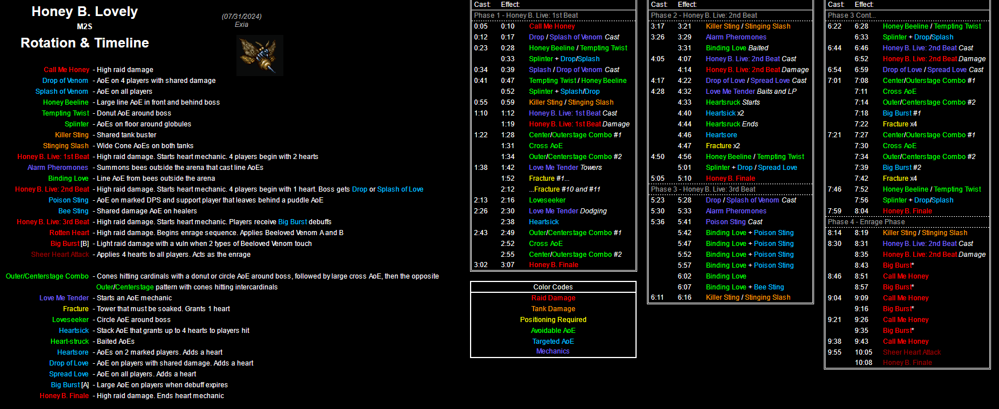

# Honey B Lovely

- [Timeline and In Depth Mechanics Overview](indepth)
- [Index of Possible Strats](strats)

<details><summary><font size="4" color="LightBlue">Video Guides</font></summary>
  <details><summary>Hope</summary>
  
  </details>
  <details><summary>Yukizuri</summary>
  
  </details>
  <details><summary>Hector</summary>
  
  </details>
  <details><summary>MTQ</summary>
  
  </details>
  <details><summary>Rainesame</summary>
  
  </details>
</details>
<br>
<details markdown=block>
  <summary><font size="4" color="LightBlue">Markers</font></summary>
  ```json
  {"Name":"M2S", "MapID":988,
  "A":{"X":100.0,"Y":0.0,"Z":91.375,"ID":0,"Active":true},
  "B":{"X":108.625,"Y":0.0,"Z":100.0,"ID":1,"Active":true},
  "C":{"X":100.0,"Y":0.0,"Z":108.625,"ID":2,"Active":true},
  "D":{"X":91.375,"Y":0.0,"Z":100.0,"ID":3,"Active":true},
  "One":{"X":91.375,"Y":0.0,"Z":91.375,"ID":7,"Active":true},
  "Two":{"X":108.625,"Y":0.0,"Z":91.375,"ID":4,"Active":true},
  "Three":{"X":108.625,"Y":0.0,"Z":108.625,"ID":5,"Active":true},
  "Four":{"X":91.375,"Y":0.0,"Z":108.625,"ID":6,"Active":true}}

  ```
</details>
[](https://photos.google.com/share/AF1QipPDyoHDQjyLP-8IGGjRC1d9S0HqC1oUey4jShiftiGohSwX3-kqq1m3mpIPVg0OfA/photo/AF1QipOX_ehUlapwQ2SSxL-V9PJJX9WxTMzuEQIac2DG?key=eWx4MUpZcFVYM1VGcVFaWjZkWGh4R3BQOFZUcGZB)
