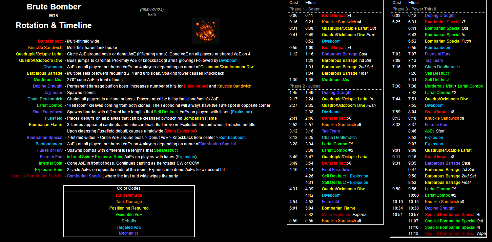

# boss name

- [Timeline and In Depth Mechanics Overview](indepth)
- [Index of Possible Strats](strats)

<details><summary><font size="4" color="LightBlue">Video Guides</font></summary>
  <details><summary>Hope</summary>
  
  </details>
  <details><summary>Yukizuri</summary>
  
  </details>
  <details><summary>Hector</summary>
  
  </details>
  <details><summary>MTQ</summary>
  
  </details>
  <details><summary>Rinon</summary>
  
  </details>
  <details><summary>Rainesama</summary>
  
  </details>
</details>
<br>
<details markdown=block>
  <summary><font size="4" color="LightBlue">Markers</font></summary>
  ```json
  {"Name":"M3S (EN)", "MapID":990,
  "A":{"X":100.0,"Y":0.0,"Z":93.0,"ID":0,"Active":true},
  "B":{"X":107.0,"Y":0.0,"Z":100.0,"ID":1,"Active":true},
  "C":{"X":100.0,"Y":0.0,"Z":107.0,"ID":2,"Active":true},
  "D":{"X":93.0,"Y":0.0,"Z":100.0,"ID":3,"Active":true},
  "One":{"X":91.5,"Y":0.0,"Z":91.5,"ID":7,"Active":true},
  "Two":{"X":108.5,"Y":0.0,"Z":91.5,"ID":4,"Active":true},
  "Three":{"X":108.5,"Y":0.0,"Z":108.5,"ID":5,"Active":true},
  "Four":{"X":91.5,"Y":0.0,"Z":108.5,"ID":6,"Active":true}}
  ```
</details>
[](https://photos.google.com/share/AF1QipNUdQ2iWVmhEmsn110Er1MOura3LamgikK8N_bJEtYzRDVSVIpM9pZOMFxnmBWuHw/photo/AF1QipOY9N1BAJ6PDuAuJRqvEdB-WUKsOeXPu5OcF9XZ?key=ak5rb2pKcGZzdUk5akxRdkJjdlU1X2trc0F2bGJB)
